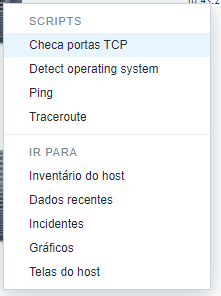
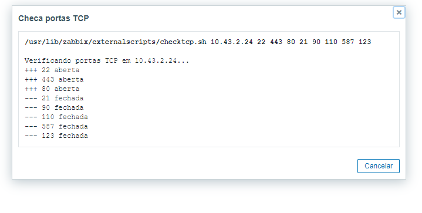

# Um telnet no seu zabbix, sem criar item
Muitas vezes precisamos fazer alguns testes mais dinâmicos em algumas portas específicas, para verificar se o alerta é real ou é um falso positivo. Geralmente utilizamos o comando `telnet`, mas, nem sempre ele está disponível. Mas, graças ao bash e seus builtins, é possível verificar portas sem executar nenhum comando a mais, apenas suas funções internas, como veremos nesse script abaixo.

As configurações abaixo irão adicionar a função de verificar portas TCP (já que as UDP não respondem) no seu mapa.

## No Zabbix server

No seu diretório de externalscripts, adicione o seguinte script:

```shell
#!/bin/bash
# CHECKTCP - Verifica portas TCP
# Raul Liborio, rauhmaru@opensuse.org
# Uso:
# checktcp.sh HOST PORTAS
#
count=0
for PORT in $@;
do
  if [ $count -ge 1 ]; then
    (echo >/dev/tcp/${1}/${PORT}) >/dev/null 2>&1 && echo "+++ ${PORT} aberta"  \
    || echo "--- ${PORT} fechada"
  else
    echo "Verificando portas TCP em $1..."
    let count++
  fi
done
exit 0
```
Em Administração > Scripts, crie o novo script:
* Nome: Checa portas TCP
* Tipo: Script
* Executar em: Servidor Zabbix (proxy)
* Comandos: `/usr/lib/zabbix/externalscripts/checktcp.sh {HOST.CONN} {$PORTA}`
* Descrição: Verifica uma porta predefinida na macro {$PORTA}


Em seguida, em Configuração > Hosts, selecione o host que ache necessário implementar essa checagem, e crie a macro `{$PORTA}`, e o seu valor deverá ser todas as portas que deverão ser testadas, separadas apenas por um espaço em branco.


## Teste
Após isso, na tela de mapas, já estará disponível o botão e o teste poderá ser realizado.


**Verificando a opção na tela de mapas**




**Executando a ação**




