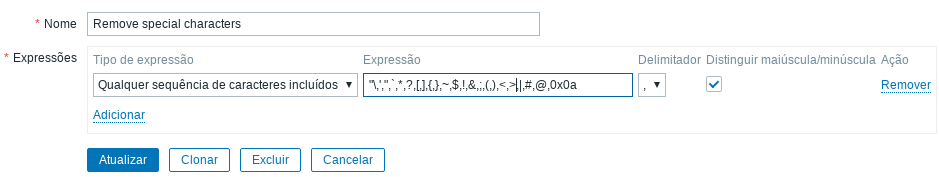

# systemd linux services
Monitoramento via Zabbix de serviços do Linux, indicado para hosts baseados em systemd


## Motivação
Após fazer o [Template para o sysV](https://github.com/rauhmaru/sysv_services_monitor), o systemd também merece ser dignamente monitorado.

## Configuração
### No host
Crie o diretório `/scripts` e mova os scripts para dentro. Não esqueça da permissão de execução:

```shell
git clone https://github.com/rauhmaru/zabbix-docs.git
mkdir /scripts
cp zabbix-docs/systemd-services-monitor/systemd_* /scripts
chmod +x /scripts systemd_*
```

Em seguida, coloque o arquivo [userparameter_systemd.conf](./userparameter_systemd.conf) no diretório de configurações do Zabbix Agent. Caso tenha instalado via gerenciador de pacote (yum, apt, zypper, etc.), ele estará no diretório `/etc/zabbix/zabbix_agentd.d/`, e em seguida, reinicie o serviço do zabbix_agent:

```shell
cp zabbix-docs/systemd-services-monitor/userparameter_systemd.conf /etc/zabbix/zabbix_agentd.d/
systemctl restart zabbix-agent
```

### No Zabbix Server
Vá em Administração > Geral > Expressões regulares e crie:

```
Nome: Remove special characters
Tipo de expressão: Qualquer sequência de caracteres incluídos
Expressão: "\,',",`,*,?,[,],{,},~,$,!,&,;,(,),<,>,|,#,@,0x0a
Delimitador: , (vírgula)
Distinguir maiúscula/minúscula: Sim
```



Importe o [template linux systemd services](./template_linux_systemd_services.xml) para o seu Zabbix Server e em seguida, adicione no servidor que deseja monitorar os serviços.


### Observações importantes
Muitos serviços até então desconhecidos irão aparecer. Recomendo que após o primeiro discovery, seja feita uma análise e que alguns (ou vários) serviços sejam desabilitados.

Atualmente o template não possui nenhuma trigger, visto que o systemd possui uma alta volatilidade no auto-gerenciamento de seus serviços, iniciando de parando conforme sua necessidade. A criação de triggers utilizando regras de LLD iria gerar um alto número de falsos-positivos.

## Rerefências
* [How To Use Systemctl to Manage Systemd Services and Units
](https://www.digitalocean.com/community/tutorials/how-to-use-systemctl-to-manage-systemd-services-and-units)
